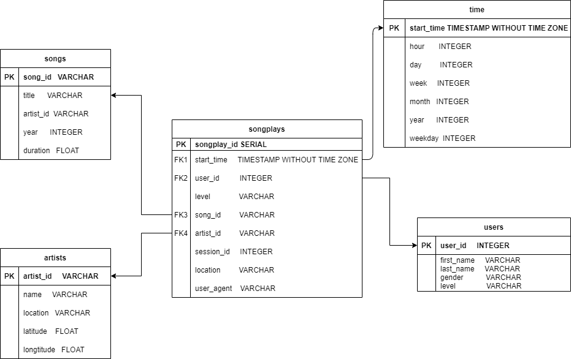

# Introduction
***

    A music streaming startup, Sparkify, has grown their user base and song database and want to move their processes and data onto the cloud. Their data resides in S3, in a directory of JSON logs on user activity on the app, as well as a directory with JSON metadata on the songs in their app.

    This project builds an ETL pipeliine that extracts their data from S3, stages them in Redshift, and transforms data into a set of dimensional tables for their analytics team to continue finding insights in what songs their users are listening to.
    
# Database Schema Design
***

There are two main parts of Schema: Fact Table and Dimension Tables. Note: PK stands for primary key and FK stands for foreign key

Fact Table

1. songplays - records in log data associated with song play i.e. records with page NextSong
    - songplay_id (PK)
    - start_time (FK to time table)
    - user_id (FK to users table)
    - level
    - song_id (FK to songs table)
    - artist_id (FK to artists table)
    - session_id
    - location
    - user_agent

Dimension Tables

1. users - users in the app
    - user_id (PK)
    - first_name
    - last_name
    - gender
    - level
2. songs - songs in music database
    - song_id (PK)
    - title
    - artist_id (FK to artists)
    - year
    - duration
3. artists - artist in music database
    - artist_id (PK)
    - name
    - location
    - latitude
    - longitude
4. time - timestamps of records in songplays broken down into specific units
    - start_time (PK)
    - hour
    - day
    - week
    - month
    - year
    - weekday
    
Songplays table is at the center of the schema and all four of dimension tables are the brances from the songplays table.

# ETL Pipeline
***

1. Load data from S3 to staging tables on Redshift, staging_events and staging_songs.
2. Load data from staging tables to the above fact and dimension tables on Redshift.

# Files in Project
***

1. create_tables.py drops all tables existed in the database and creates all tables.
2. dwh.cfg contains all information of the database.
3. etl.py loads data to the staging tables and inserts data into the analytic tables.
4. sql_queries contains all needed queries for create_tables and etl file.
5. READE.md provides the information of projects.
4. images folder contains the ER diagram of this project.

# How to Run the Project
***

- Run create_tables.py to create all tables on Redshift.
- Then run etl.py to load all data to the tables on Redshift.

# ER Diagram
***

